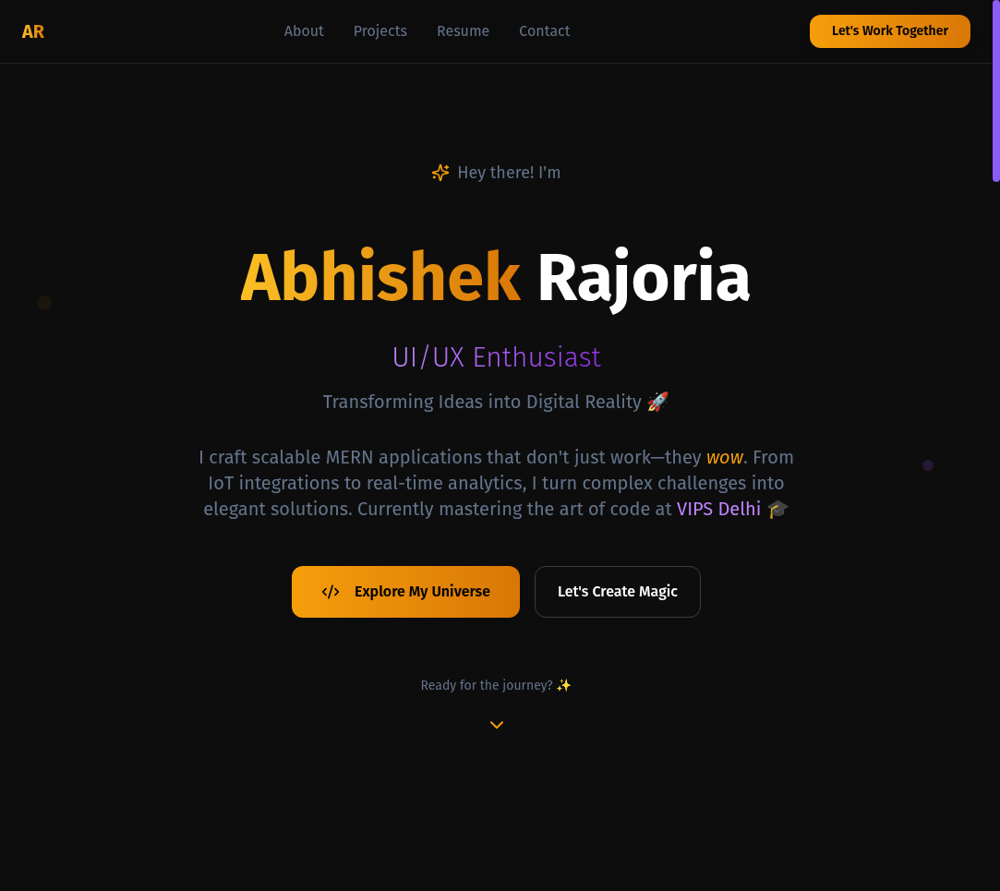

# Abhishek Rajoria's Portfolio 🚀

A modern, high-performance portfolio website showcasing full-stack development expertise with cutting-edge technologies. Features interactive project galleries, real-time visitor tracking, and a stunning constellation-based skills visualization.



## 🌟 Features

### 🎨 **Interactive User Experience**
- **Stunning Hero Section**: Dynamic gradient animations with smooth call-to-action buttons
- **Skills Constellation**: Interactive star-based visualization with draggable technology nodes
- **Project Gallery**: Advanced modal system with zoom, pan, and multi-media support
- **Mobile-Optimized**: Floating navigation bar and responsive design for all devices
- **Glass Morphism Design**: Modern frosted glass effects throughout the interface

### 📊 **Advanced Functionality**
- **Visitor Tracking**: Real-time email alerts with location and device analytics
- **Resume Modal**: Embedded PDF viewer with download functionality
- **Contact System**: Integrated contact form with Web3Forms API
- **Image Zoom**: Click-to-zoom with pan controls and zoom level indicators
- **Smooth Animations**: Framer Motion powered transitions and micro-interactions

### 🔧 **Technical Excellence**
- **Performance Optimized**: Hardware acceleration, lazy loading, and efficient rendering
- **SEO Friendly**: Meta tags, semantic HTML, and search engine optimization
- **Accessibility**: WCAG compliant with proper ARIA labels and keyboard navigation
- **Type Safety**: Full TypeScript implementation for robust development

## 🛠️ Tech Stack

### **Frontend Mastery**
- **React.js 18**: Modern hooks and component architecture
- **TypeScript**: Type-safe development with enhanced IDE support
- **TailwindCSS**: Utility-first styling with custom design system
- **Framer Motion**: Advanced animations and gesture handling
- **React Query**: Efficient data fetching and state management
- **Zustand**: Lightweight state management
- **Chart.js**: Interactive data visualizations

### **Backend Integration**
- **Node.js**: Server-side JavaScript runtime
- **Express.js**: Web application framework
- **REST API**: RESTful service architecture
- **JWT**: Secure authentication tokens
- **Bcrypt.js**: Password hashing and security

### **Database & Storage**
- **MongoDB**: NoSQL document database
- **Supabase**: Backend-as-a-Service platform
- **Cloudinary**: Image and video cloud storage
- **Prisma**: Next-generation ORM

### **Development & Deployment**
- **Vite**: Lightning-fast build tool and dev server
- **ESLint & Prettier**: Code linting and formatting
- **Docker**: Containerization for consistent environments
- **Vercel**: Frontend deployment and hosting
- **Railway**: Backend deployment platform
- **Git & GitHub**: Version control and collaboration

## 🚀 Getting Started

### Prerequisites
- Node.js (v18 or higher)
- npm, yarn, or bun package manager

### Installation

1. **Clone the repository**
```bash
git clone https://github.com/Abhishek1334/Abhishek-Rajoria-Portfolio.git
cd Abhishek-Rajoria-Portfolio
```

2. **Install dependencies**
```bash
npm install
# or
yarn install
# or
bun install
```

3. **Start development server**
```bash
npm run dev
# or
yarn dev
# or
bun dev
```

4. **Open browser**
Navigate to [http://localhost:8080](http://localhost:8080)

## 📁 Project Structure

```
src/
├── components/           # React components
│   ├── ui/              # Reusable UI components (Shadcn)
│   ├── contact/         # Contact form components
│   ├── AboutSection.tsx # About section with skills
│   ├── HeroSection.tsx  # Landing hero section
│   ├── ProjectsSection.tsx # Project showcase
│   ├── ProjectModal.tsx # Project detail modal
│   ├── SkillsConstellation.tsx # Interactive skills visualization
│   ├── MobileFloatingNav.tsx # Mobile navigation
│   └── ResumeModal.tsx  # PDF resume viewer
├── hooks/               # Custom React hooks
│   ├── useVisitorTracking.ts # Visitor analytics
│   └── use-toast.ts     # Toast notifications
├── integrations/        # External service integrations
│   └── supabase/        # Supabase configuration
├── Media/               # Project assets and images
│   ├── Festify/         # Festify project media
│   ├── MarketPulse/     # MarketPulse project media
│   └── StayFinder/      # StayFinder project media
├── pages/               # Page components
├── lib/                 # Utility functions
└── index.css           # Global styles and custom CSS
```

## 🎯 Key Components

### **Skills Constellation**
Interactive star-based visualization featuring:
- Draggable technology nodes with real connections
- Particle effects and twinkling animations
- Category-based filtering system
- Mouse trail interactions
- Mobile-responsive grid fallback

### **Project Modal System**
Advanced project showcase with:
- Multi-media support (images and videos)
- Zoom and pan functionality for detailed viewing
- Tabbed content organization
- Responsive design for all screen sizes
- Smooth navigation between project slides

### **Visitor Tracking**
Real-time analytics featuring:
- IP-based location detection
- Device and browser information
- Email notifications via Web3Forms
- Session-based tracking to prevent duplicates

### **Mobile Experience**
Optimized mobile interface with:
- Floating navigation bar with smooth animations
- Touch-friendly interactions
- Responsive layout adaptations
- Hardware-accelerated scrolling

## 🎨 Customization

### **Theme Configuration**
Customize the design system in `tailwind.config.ts`:

```typescript
export default {
  theme: {
    extend: {
      colors: {
        primary: '#f59e0b',      // Amber
        secondary: '#8b5cf6',     // Purple
        accent: '#10b981',        // Emerald
      },
      animation: {
        'float': 'float 6s ease-in-out infinite',
        'pulse-glow': 'pulse-glow 2s ease-in-out infinite',
      }
    }
  }
}
```

### **Adding Projects**
Add new projects in `src/components/ProjectsSection.tsx`:

```typescript
const projects = [
  {
    id: 'unique-id',
    title: 'Project Name',
    subtitle: 'Project Description',
    description: 'Detailed description...',
    image: 'path/to/image.png',
    tags: ['React', 'Node.js', 'MongoDB'],
    liveUrl: 'https://your-project.com',
    githubUrl: 'https://github.com/username/repo',
    media: [
      { type: 'image', url: 'screenshot1.png', alt: 'Description' },
      { type: 'video', url: 'demo.mp4', alt: 'Demo video' }
    ],
    detailedContent: {
      overview: 'Project overview...',
      features: ['Feature 1', 'Feature 2'],
      techStack: ['React.js', 'Node.js'],
      highlights: ['Achievement 1', 'Achievement 2']
    }
  }
];
```

## 🚀 Featured Projects

### **Market Pulse** 📈
**Advanced Stock Market Analytics Dashboard**

A cutting-edge stock market analytics platform that provides real-time market data, advanced charting capabilities, portfolio tracking, and customizable watchlists. Features both light and dark mode interfaces with responsive design.

**Key Features:**
- Real-time Stock Charting with multiple timeframes (1D, 1M, 1Y, ALL)
- Advanced Analytics Dashboard with key market metrics
- Portfolio Management with performance tracking
- Customizable Watchlist with real-time price updates
- Interactive Charts with zoom, pan, and technical indicators
- Light/Dark Mode with persistent theme preferences
- JWT Authentication for secure user sessions

**Tech Stack:** React.js 18, TypeScript, Vite, Tailwind CSS, Zustand, Chart.js, React Query, Express.js, Node.js, JWT, Yahoo Finance API

**Live Demo:** [Market Pulse](https://market-pulse-two.vercel.app/) | **GitHub:** [Repository](https://github.com/Abhishek1334/MarketPulse)

### **StayFinder** 🏠
**Airbnb-Inspired Property Booking Platform**

A full-stack web application inspired by Airbnb, allowing users to list, search, and book properties for short-term or long-term stays. Demonstrates end-to-end development skills across frontend, backend, and database layers.

**Key Features:**
- Property browsing with image galleries and detailed descriptions
- Advanced search and filtering by location, price range, and dates
- Complete booking flow with date selection and confirmation
- User authentication with registration and login validation
- Host dashboard for property management
- Mock payment integration with Stripe
- Responsive design optimized for all devices

**Tech Stack:** React, TypeScript, Redux Toolkit, Tailwind CSS, Node.js, Express, MongoDB, JWT, Stripe, Vite

**Live Demo:** [StayFinder](https://stayfinder-eta.vercel.app/) | **GitHub:** [Repository](https://github.com/Abhishek1334/StayFinder)

### **Festify** 🎉
**Local Event Aggregator App**

A local event aggregator platform where users can discover, create, RSVP, and manage events. Supports QR code-based ticketing, a complete check-in system for organizers, and a clean, modern user interface.

**Key Features:**
- JWT Authentication for secure login/signup
- Event Management: Create, Edit, Delete Events (Organizers)
- Ticketing System with QR Code Generation
- QR Code Scanner using Html5Qrcode for attendee verification
- Organizer Dashboard with check-ins details
- RSVP Management in user profile
- Image Uploads via Multer + Cloudinary
- Event Search & Filter by category

**Tech Stack:** React.js, Vite, Context API, Tailwind CSS, Node.js, Express.js, MongoDB, JWT, Bcrypt.js, Multer, Cloudinary, qrcode.react, Html5Qrcode

**Live Demo:** [Festify](https://festify-tau.vercel.app/) | **GitHub:** [Repository](https://github.com/Abhishek1334/Festify)

## 🚀 Deployment

### **Vercel Deployment**
1. Connect your GitHub repository to Vercel
2. Configure build settings:
   ```bash
   Build Command: npm run build
   Output Directory: dist
   Install Command: npm install
   ```
3. Deploy automatically on push to main branch

### **Environment Variables**
Set up required environment variables:
```bash
VITE_SUPABASE_URL=your_supabase_url
VITE_SUPABASE_ANON_KEY=your_supabase_key
VITE_WEB3FORMS_KEY=your_web3forms_key
```

## 📱 Browser Support

- Chrome 88+
- Firefox 85+
- Safari 14+
- Edge 88+
- Mobile browsers (iOS Safari, Chrome Mobile)

## 🔧 Performance Optimizations

- **Image Optimization**: WebP format with fallbacks
- **Code Splitting**: Lazy loading of route components
- **Bundle Analysis**: Optimized chunk sizes
- **Hardware Acceleration**: CSS transforms and GPU utilization
- **Efficient Rendering**: React.memo and useMemo optimizations

## 🤝 Contributing

Contributions are welcome! Please follow these steps:

1. Fork the repository
2. Create a feature branch (`git checkout -b feature/amazing-feature`)
3. Commit your changes (`git commit -m 'Add amazing feature'`)
4. Push to the branch (`git push origin feature/amazing-feature`)
5. Open a Pull Request

## 📄 License

This project is licensed under the MIT License - see the [LICENSE](LICENSE) file for details.

## 👨‍💻 Author

**Abhishek Rajoria**
- 🌐 Portfolio: [Abhishek-Rajoria.vercel.app](https://abhishek-rajoria.vercel.app)
- 📧 Email: [AbhishekRajoria24@gmail.com](mailto:AbhishekRajoria24@gmail.com)
- 💼 LinkedIn: [linkedin.com/in/AbhishekRajoria](https://linkedin.com/in/AbhishekRajoria)
- 🐱 GitHub: [@Abhishek1334](https://github.com/Abhishek1334)
- 📱 Phone: +91 9319054781

## 🎓 Education & Certifications

- **Bachelor of Computer Applications** - VIPS Delhi (2022-Present) - CGPA: 7.92
- **IBM Frontend Web Development** - Certified Internship (June-August 2024)
- **Newton School SQL Fundamentals** - Certificate (March 2025)

## 🙏 Acknowledgments

- [React.js](https://reactjs.org/) - The library that powers the UI
- [TailwindCSS](https://tailwindcss.com/) - For the amazing utility-first styling
- [Framer Motion](https://www.framer.com/motion/) - For smooth animations
- [Shadcn/ui](https://ui.shadcn.com/) - For beautiful, accessible components
- [Lucide Icons](https://lucide.dev/) - For consistent, beautiful icons
- [Supabase](https://supabase.com/) - For backend services
- [Vercel](https://vercel.com/) - For seamless deployment

---

⭐️ **Star this repository if you found it helpful!**

📝 **Feel free to use this as a template for your own portfolio**

🚀 **Built with passion for clean code and great user experiences**
